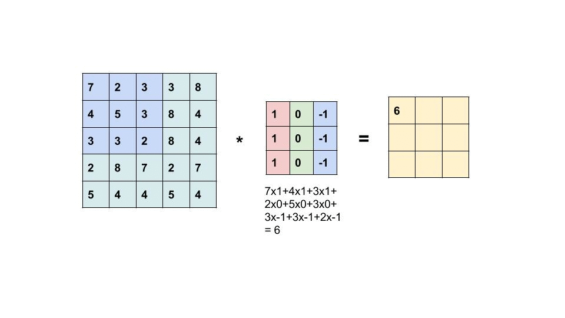

# **Image Convolution** #

  

This project represents an implementation of an image convolution operator. This project was given as a course midterm.
The assignment was to implement an image convolution from scratch, which allows a different kind of parameters as sliding window size, window step size, etc.
For more information, the midterm is attached as a pdf file (Note that part 1 of this midterm is excluded. This implementation regards to part 2 of the midterm).

## Instructions: ##
Please upload the photos from the directory called "data/inputs" into the notebook, and run the notebook.
More explemations can be found in the report.pdf file.
