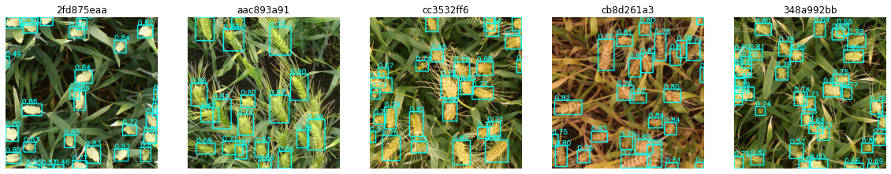

# **Wheat Detection** #

  

This project is used to detect wheat bounding boxes within each image as part of the "global-wheat-detection" Kaggle's competition.
Also, it is the final project of the Computer Vision course.

The project includes state-of-the-art tools and technologies from the world of Computer Vision to improve the results, some of them:
1. YOLOv5: https://github.com/ultralytics/yolov5.
2. Detectron2: https://github.com/facebookresearch/detectron2, and other Faster RCNN architectures.
3. WBF (Weighted Box Fusion): https://github.com/ZFTurbo/Weighted-Boxes-Fusion.
4. NMS (Non Maximal Suppression).
5. TTA (Test Time Augmentation).

## Instructions: ##
Please use the dataset from the link: https://www.kaggle.com/eylonmizrahi/globalwheat
This link includes the global-wheat-detection dataset and the model weights used in this project.
For more information, open the assignment file or the notebooks themselves. Also, it is recommended to visit the links supplied in this document.
Note that one of the notebooks includes the whole code of the project, while the other is in the submission format of Kaggle's global-wheat-detection contest.

## Credits and References: ##
1. Link to the contest: https://www.kaggle.com/c/global-wheat-detection
2. WBF paper: https://arxiv.org/abs/1910.13302